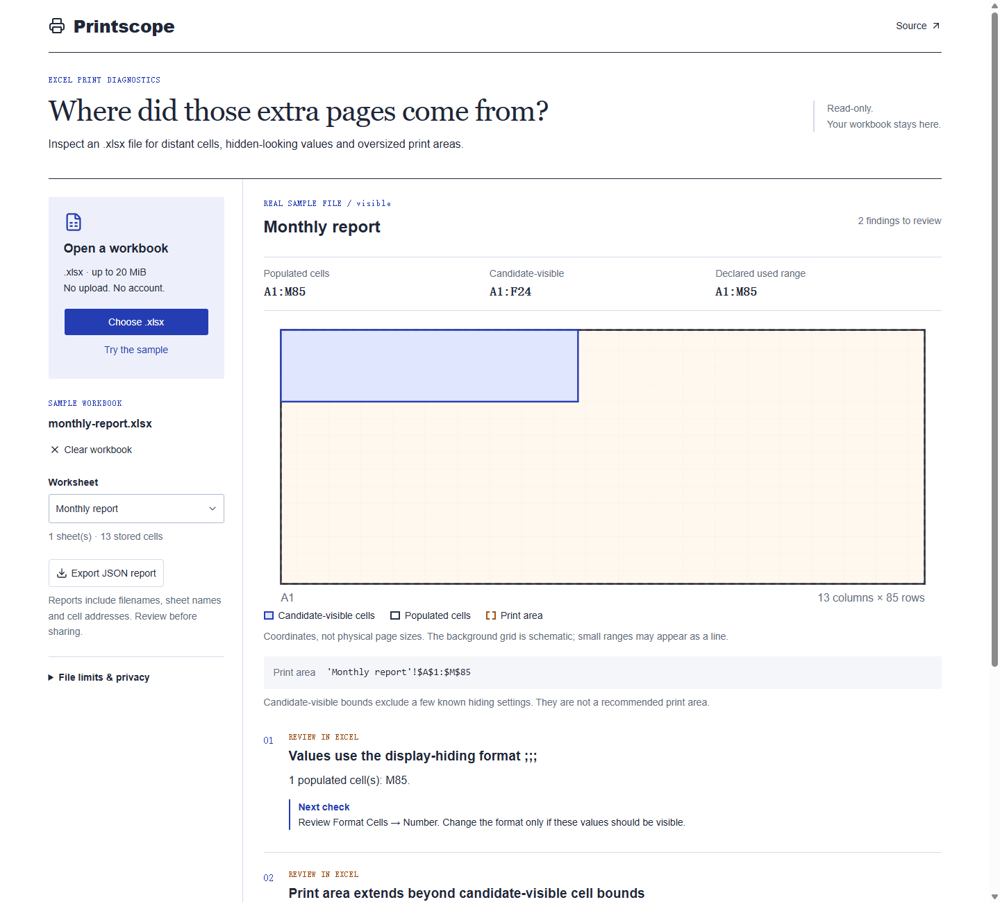

# Printscope

Find structural clues behind unexpected blank Excel print pages, without changing the workbook.

[Open Printscope](https://yougan001.github.io/printscope/) · [中文说明](README.zh-CN.md) · [Testing notes](docs/testing.md) · [Releases](https://github.com/Yougan001/printscope/releases)

Choose a workbook, select a worksheet, and review the evidence next to the cell-coordinate map. Export a JSON report to keep the findings. Files are processed in a cancellable browser worker; nothing in the workbook is uploaded or changed.



The included sample has report values in `A1:F24` and a value in `M85` hidden by `;;;`. Its print area includes both. Download the sample from the app and inspect M85 in Excel to check the diagnosis yourself.

## What it checks

- Declared, stored, populated and candidate-visible cell bounds, kept separate.
- Values hidden by the exact custom number format `;;;`.
- Explicit white fonts, hidden rows/columns and errors configured to print blank.
- Fixed print areas, multiple print areas and manual page breaks.
- Cell-anchored drawings extending beyond the data.
- Unsupported expressions and display features, reported as limitations instead of guessed results.

This is **not a pagination engine**. It cannot predict an exact page count, calculate formulas or establish that a workbook is safe to print. Always confirm changes in Excel's Page Break Preview. No cells are deleted and no workbook is rewritten.

## Use the core

Node.js 22.13 or newer:

```sh
npm ci
npm test
npm run dev
```

```js
import { readFile } from 'node:fs/promises';
import { inspectWorkbook } from './core/workbook.mjs';

const report = inspectWorkbook(new Uint8Array(await readFile('report.xlsx')));
console.log(JSON.stringify(report, null, 2));
```

Reports contain sheet names, cell addresses, print settings and findings, but not cell values or formula text. Treat reports as potentially sensitive metadata.

## Boundaries

Ordinary unencrypted `.xlsx` only; no `.xls`, `.xlsb` or macro-enabled workbooks. Up to 20 MiB per file, 50 sheets, 100,000 stored cells, 100,000 shared strings and 20,000 styles. Each inspected XML part is bounded to 12 MiB, with 64 MiB of cumulative XML reads. ZIP directory, expanded size, checksum, XML nesting and node limits are checked. Nothing is extracted to the filesystem or fetched from workbook relationships.

Conditional formatting, theme colors, merged visual extents, legacy drawings, printer metrics and some inherited display settings are not evaluated. Candidate-visible bounds are a diagnostic reference, **not** a suggested replacement print area. Files hitting a limit fail with an explanation rather than returning a partial clean bill of health.

## Background

Microsoft documents several causes of blank printed pages, including hidden-looking values, blank error printing and distant objects: [Blank pages unexpectedly printed in Excel](https://learn.microsoft.com/en-us/troubleshoot/microsoft-365-apps/excel/blank-pages-unexpectedly-printed). The workbook reader follows the [SpreadsheetML worksheet structure](https://learn.microsoft.com/en-us/office/open-xml/spreadsheet/working-with-sheets) and [PageSetup attributes](https://learn.microsoft.com/en-us/dotnet/api/documentformat.openxml.spreadsheet.pagesetup?view=openxml-3.0.1).

## Development and contributions

React, TypeScript, Vinext and Vite, with a framework-independent inspection core. `fflate` handles decompression and `fast-xml-parser` validates/parses XML. GitHub Actions tests, checks types and builds the static app before publishing to Pages. No application server or API key is needed.

```sh
npm run lint
npm run typecheck
npm run build
```

Reproducible edge cases are welcome. Do not attach a private workbook to a public issue: create a fresh, minimal workbook with invented values, or describe the relevant XML settings and your Excel version. Useful issues include the expected result, actual finding and a tiny sample that preserves the problem.

Use the [workbook issue form](https://github.com/Yougan001/printscope/issues/new?template=workbook-problem.yml) and read the [contribution guide](CONTRIBUTING.md) for safe samples and regression checks.

MIT licensed. See [third-party notices](THIRD_PARTY_NOTICES.md) for reused components and icons.
